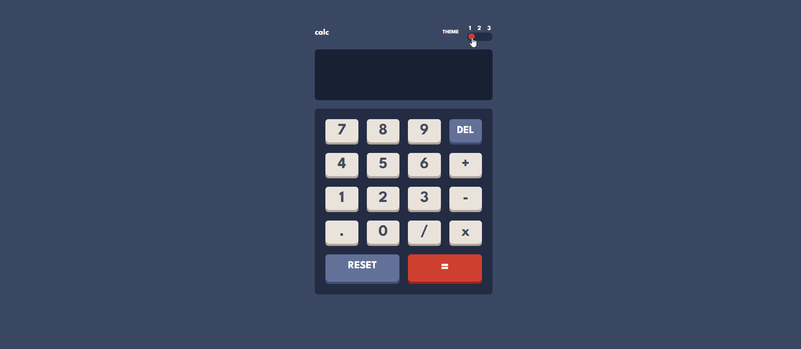

# Calculator App

# 🖥️ Projeto

Este projeto é uma calculadora, com a funcionalidade de mudança da estilização dos temas de cores.

# ⚙️ Tecnologias
* [React](https://reactjs.org/)
* [Typescript](https://www.typescriptlang.org/)
* [Tailwind](https://tailwindcss.com/)
* [FrontEnd Mentor](https://www.frontendmentor.io/)

# 📱 Layout

Você pode acessar o projeto acessando o link abaixo.

 <a href="https://calculator-app-main-six.vercel.app/">Projeto<a/>
